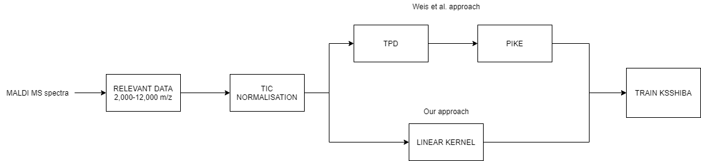

# Klebsiellas Resistant Mechanisms and Antibiotic Prediction Library

## Folder structure:

- **Data folder**:
    - Reproducibilidad: data collected during 3 days of the same Klebsiellas from _Gregorio Marañón_ Hospital (HGM) and normalized by TIC normalization.
    - Klebsiellas_RyC: data collected during 3 days of the same Klebsiellas from _Ramón y Cajal_ Hospital (RyC) and normalized by TIC normalization.
    - DB_conjunta.xlsx: phenotype resistant mechanisms, genotype resistant mechanisms and antibiotic resistance data from both hospitals.
- **Results**: pkl files with the SSHIBA model trained for each case.
- **lib**: SSHIBA library model.

## Read raw data:
To convert the data from Bruker to Python readable files, MaldiQuant package from R is used in _fromBrukertoMzml_ script.

## Preprocess the data:
We have two preprocess data scripts:
    - data_hgm.py
    - data_hgm.py

Every scripts does the same. First, we read the data of the 3 days of the hospital. For each unique sample we have it repetead several times, this amount of times can move between 1 and 12 times. To balance the data we propose the median aproach: for each unique sample we calculate the median synthethic sample and then we make the difference between all the real samples and our median one. The sample that is closest to our median is the one that we are going to use to train our model. In that way we get rid of possible outliers and measurement errors. It may occur that for a specific family we have heavy unbalanced data such as AMOXICILINA which in _HGM_ we have 83 non-resistant samples and 211 resistant ones. To tackle with that we propose to oversample the minority class labels. After all this we propose to make 10 stratified folds to then test our results. The MALDIs signal is then normalized by TIC technique. The preprocess pipeline can be seen here:

## Baselines
The baselines proposed are implemented in:
- gm_baseline.py: training and testing with HGM data. Different baselines can be found inside.
- trainHGM_predictHRC_BASELINE.py: training with HGM data and testing with HRC data. Different baselines can be found inside.

## SSHIBA model:
The model used to learn the data is **SSHIBA** [[1]](#1) and its kernel approach **KSSHIBA** [[2]](#2). Two scenarios are found:
* First scenario: HGM data.
    - Views:
        - MALDI linear/rbf kernel.
        - Phenotype Resistant Mechanism multilabel.
        - 9 multilabel views: one per antibiotic.
The script is:
* gm_model.py: SSHIBA model trained and tested in HGM data.

* Second scenario: HGM data for training and HRC data for testing.
    - Views:
        - MALDI linear/rbf kernel.
        - Genotype Resistant Mechanism multilabel: missing for HGM, full for HRC.
        - Phenotype Resistant Mechanism multilabel.
        - 9 multilabel views: one per antibiotic.

The script is:
* trainHGM_predictHRC_model.py: SSHIBA model trained in HGM data and tested in HRC data.

## Results:
We analyse different things about the results:
- AUC per prediction task
- Common and private latent space per view
- W primal space matrix per view
- Z latent space projection

All this calculus and plots code can be found in:
* show_fullresults.py: for HGM data case.
* show_results_trainHGM_predictHRC.py: training with HGM and testing in HRC data.

## References
<a id="1">[1]</a>
Sevilla-Salcedo, Carlos, Vanessa Gómez-Verdejo, and Pablo M. Olmos. 
"Sparse Semi-supervised Heterogeneous Interbattery Bayesian Analysis." 
arXiv preprint arXiv:2001.08975 (2020).

<a id="2">[2]</a>
Sevilla-Salcedo, C., Guerrero-López, A., Olmos, P. M., & Gómez-Verdejo, V. (2020). 
Bayesian Sparse Factor Analysis with Kernelized Observations. 
arXiv preprint arXiv:2006.00968.

