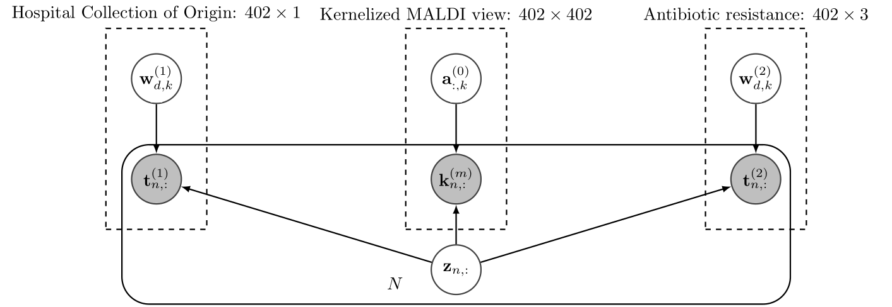
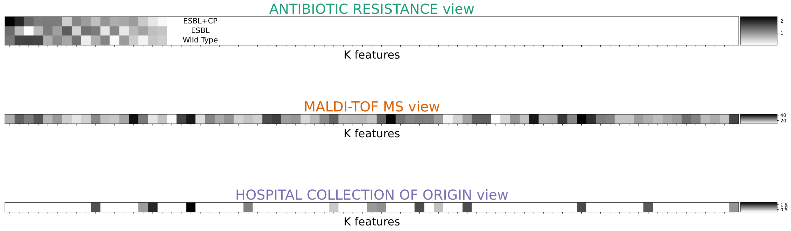

# Library that implements "Development and Validation of a MALDI-TOF-Based Model to Predict Extended-Spectrum Beta-Lactamase and/or Carbapenemase-Producing Klebsiella pneumoniae Clinical Isolates" paper

This GitHub presents the work done in this preprint [[4]](#4) that has been submitted to peer-reviewed journal and it is now under revision.

## Folder structure:

- **Data folder**:
    - GM/GM_AST.xlsx: AST associated with each MALDI from _Gregorio Marañón_ Hospital (GM)
    - RyC/RyC_AST:  AST associated with each MALDI from _Ramón y Cajal_ Hospital (RyC).
    - gm_data_paper.pkl: MALDI MS and AST stored and preprocessed from GM.
    - ryc_data_paper.pkl: MALDI MS and AST stored and preprocessed from RyC.
    - GM_XSTRATIFIEDfolds_paper.pkl: X(5 or 10) train-test fold partition for GM data.
    - GM_XSTRATIFIEDfolds_paper.pkl: X(5 or 10) train-test fold partition for RyC data.
- **lib**: SSHIBA library model.

## Preprocess the data:
We have two preprocess data scripts:
- data_hgm.py
- data_hgm.py

Every scripts does the same. First, we read the data of the 3 days of each collection. For each unique sample we have it repetead several times. To select a MALDI MS for strain we propose the median approach: for each unique sample we calculate the median synthethic sample and then we make the difference between all the real samples and our median one. The sample that is closest to our median is the one that we are going to use to train our model. In that way we get rid of possible outliers and measurement errors. Finally, we propose to make 10 stratified folds train-test our results. The MALDIs signal is then normalized by TIC technique. The preprocess pipeline can be seen in Figure 1.


## SSHIBA model:
The model used to learn the data is Sparse Semi-supervised Heterogeneous Interbattery Bayesian Analysis (**SSHIBA**) [[1]](#1) and its kernel approach kernelized-SSHIBA (**KSSHIBA**) [[2]](#2). SSHIBA is a Bayesian kernel model capable of jointly working with heterogeneous multi-view data such as continuous kernelized data or multilabel, as well as dealing with missing data in any view. For this work, two scenarios are found.

### How to use SSHIBA:
Under construction...

First thing you have to do define the hyperparameters:
  ```
hyper_parameters = {'sshiba': {"prune": 1, "myKc": 100, "pruning_crit": 50, "max_it": int(5000)}}
  ```
These hyperparamets define:
* Prune: if you want that the model prunes the latent space automatically at each iteration. If true, you have to define "prunning crit".
* Prunning_crit: minimum value that the mean of every column in Z latent space to prune it. Depends on the input data scale.
* myKc: starting dimension of the latent space Z. If prune is False (0) it is also the final dimension of the latent space because the model is not going to prune it.
* max_it: maximum number of iterations that the model will do. The model always will stop once the ELBO has converged but if the ELBO has not converged yet it will stop at max_it.

Secondly, you have to declare the model:
```
import fast_fs_ksshiba_b_ord as ksshiba
myModel_mul = ksshiba.SSHIBA(hyper_parameters['sshiba']['myKc'], hyper_parameters['sshiba']['prune'], fs=1)
```
* FS means feature selection. If is true, the model will impose ARD to the views that are capable of doing that and select the most relevant features. Take into account that, for kernelized views, there is not feature selection.

Thirdly: declare the data. You have to take into account that SSHIBA is not a supervised method but a semisupervised one. That means that there no exists "inputs" and "outputs" views. The model will predict/impute any missing values that exists in any possible views, therefore it can work with missing data. 
Then, as in this work we wanted to predict the Antibiotic Resistance for some MALDIs what we did was bassically do not include the Antibiotic Resistance that we wanted to predict therefore they are missing and the model will predict them. This means that, for example if:
* "maldi_view" was a 402x10000 matrix having the 402 isolates.
* "indicator_view" was a 402x1 matrix having the label from which collection the isolates were comming from.
* "ast_view" was 300x1 matrix. Therefore, 102 missing values were predicted.

To do so, you have to declare this data using "struct_data" method:
```
# MALDI kernelized view
maldi_view = myModel_mul.struct_data(maldi_view, method="reg", kernel=kernel)
# Antibiotic Resistance mechanisms view: a multilabel view
ast_view = myModel_mul.struct_data(ast_view, method="mult")
# HOSPITAL COLLECTION OF ORIGIN view: a multilabel view (binary)
indicator_view = myModel_mul.struct_data(indicator_view, method="mult")
```
"struct_data" method gives the proper shape that SSHIBA wants for a new input data. You have to know which type of data do you want to input and tell it to SSHIBA my "method" argument:
* mult: means a multilabel or binary view
* reg: means a real view. This view is also used for kernelized views if you add then another argument telling which kernel to use:
  * pike: PIKE kernel proposed by [[3]](#3)
  * rbf: RBF Gaussian kernel.
  * linear: linear kernel.
* cat: means a categorical view. Categorical views are under testing right now. We don't recommend to use them. Instead use a multilabel approximation scenario by one-hot encoding them.

Finally, you just need ot train the model.

### Intracollection scenario:
The Intracollection scenario is presented in Figure 2.

Still creating the plots... It will be here soon ;)

This scenario works with 2 views:
* : MALDI MS kernelized (linear, rbf or pike) view.
* : Antibiotic resistance (CP+ESBL, ESBL, S) view

In this scenario we use the KSSHIBA framework to: reduce dimensionality by using kernel trick, reduce training complex by kernel trick and latent space projection, get rid of cross-validation issues by Bayesian framework and obtain a predictive probability distribution. The model could also work with missing data, bassically, if you have missing data just put a "np.NaN" where the missing is and the model itself will impute this missing by using the predictive probability distribution.

The difference between both collections is just the number of samples (in this scenario). Therefore, the model will use 120 samples for RyC collection and 282 for GM collection. However, we implemented two differents scripts just because when we were trying out approaches we proposed, at the begining, different ideas for each collection. Eventually, it developed in the same script with different data.

The scripts are found in:
* gm_ksshiba.py
* ryc_ksshiba.py

Moreover, the baselines proposed for this scenario can also be found in:
* gm_baselines.py
* ryc_baselines.py


### Intercollection scenario:
 The Intercollection scenario is presented in Figure 3.

This scenario works with 3 views:
* : MALDI MS kernelized (linear, rbf or pike) view.
* : Hospital Collection Origin (GM or RyC) view.
* : Antibiotic resistance (CP+ESBL, ESBL, WT) view

In this scenario we exploit the multiview framework of KSSHIBA and it is the major contribution of the research. Using this multiview approach, we can work with an extra label that indicates to the model from which data distribution is the sample comming from. This way, the model can learn the common information of both distributions (as they both explain the same microorganism) but getting rid of possible misinformation that can occur only in intracollection scenarios. As it is explained on the Discussion part of the paper, this extra view helps the model to not get biased by unbalanced presence in both collections.

The script is found in:
* intercollection_ksshiba.py

Moreover, the baselines proposed for this scenario can also be found in:
* intercollection_baselines.py

## Results:


## Latent space:
SSHIBA calculates a  projection matrix associated to each view. However, when the view is kernelized it calculates the dual space projection matrix , we have to recover the primal space  projection matrix by doing: . 
This  is a projection matrix of shape _DxK_ being _D_ the dimension of the data and _K_ the dimension of the latent space that SSHIBA decides by optimisation. Then, each _K_ column of the  matrix is a projection weight vector associated to each dimension data point and can be interpretable. First, we can plot each the K columns by computing the mean over the D rows to show how every view is correlated to all the others views as we can see in Figure 2:


This example is extracted from the intrahospital scenario shown in the paper.

Further explanation comming soon...

All these calculus and plots explained in this section can be found in:
* show_results.py

## References
<a id="1">[1]</a>
Sevilla-Salcedo, Carlos, Vanessa Gómez-Verdejo, and Pablo M. Olmos. 
"Sparse Semi-supervised Heterogeneous Interbattery Bayesian Analysis." 
Patern Recognition (2021).

<a id="2">[2]</a>
Sevilla-Salcedo, C., Guerrero-López, A., Olmos, P. M., & Gómez-Verdejo, V. (2020). 
Bayesian Sparse Factor Analysis with Kernelized Observations. 
arXiv preprint arXiv:2006.00968.

<a id="3">[3]</a>
Caroline Weis, Max Horn, Bastian Rieck†, Aline Cuénod, Adrian Egli, and Karsten Borgwardt. (2020). 
Topological and kernel-based microbial phenotype prediction from MALDI-TOF mass spectra
Bioinformatics, Volume 36, Issue Supplement_1, July 2020, Pages i30–i38

<a id="4">[4]</a>
Alejandro Guerrero-López, Ana Candela, Carlos Sevilla-Salcedo, Marta Hernández-García, Pablo M. Olmos, Rafael Cantón, Patricia Muñoz, Rosa del Campo, Vanessa Gómez-Verdejo, Belen Rodríguez-Sánchez.
Development and Validation of a MALDI-TOF-Based Model to Predict Extended-Spectrum Beta-Lactamase and/or Carbapenemase-Producing in Klebsiella pneumoniae Clinical Isolates
https://www.biorxiv.org/content/10.1101/2021.10.04.463058v1


