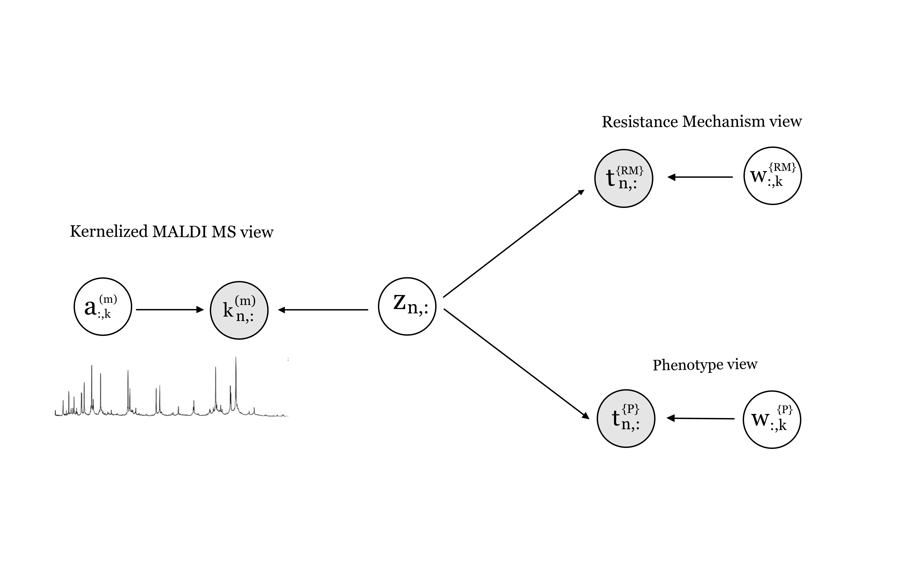
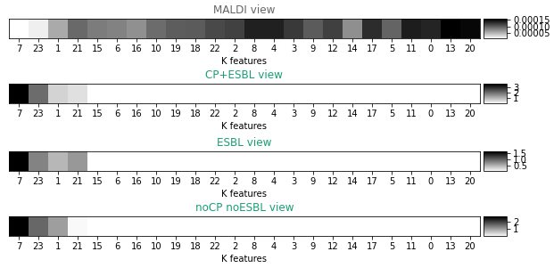

# Klebsiellas Pneumoniae Resistant Mechanisms and Antimicrobial Resistance Prediction library

## Folder structure:

- **Data folder**:
    - Reproducibilidad: data collected during 3 days of the same Klebsiellas from _Gregorio Marañón_ Hospital (HGM) and normalized by TIC normalization.
    - Klebsiellas_RyC: data collected during 3 days of the same Klebsiellas from _Ramón y Cajal_ Hospital (RyC) and normalized by TIC normalization.
    - DB_conjunta.xlsx: phenotype resistant mechanisms, genotype resistant mechanisms and antibiotic resistance data from both hospitals.
- **Results**: pkl files with the SSHIBA model trained for each case.
- **lib**: SSHIBA library model.

## Read raw data:
To convert the data from Bruker to Python readable files, MaldiQuant package from R is used in _fromBrukertoMzml_ script.

## Preprocess the data:
We have two preprocess data scripts:
    - data_hgm.py
    - data_hgm.py

Every scripts does the same. First, we read the data of the 3 days of the hospital. For each unique sample we have it repetead several times, this amount of times can move between 1 and 12 times. To balance the data we propose the median aproach: for each unique sample we calculate the median synthethic sample and then we make the difference between all the real samples and our median one. The sample that is closest to our median is the one that we are going to use to train our model. In that way we get rid of possible outliers and measurement errors. It may occur that for a specific family we have heavy unbalanced data such as AMOXICILINA which in _HGM_ we have 83 non-resistant samples and 211 resistant ones. To tackle with that we propose to oversample the minority class labels. After all this we propose to make 10 stratified folds to then test our results. The MALDIs signal is then normalized by TIC technique. The preprocess pipeline can be seen in Figure 1.

## Baselines
The baselines proposed are implemented in:
- gm_baseline.py: training and testing with HGM data. Different baselines can be found inside.
- trainHGM_predictHRC_BASELINE.py: training with HGM data and testing with HRC data. Different baselines can be found inside.

## SSHIBA model:
The model used to learn the data is Sparse Semi-supervised Heterogeneous Interbattery Bayesian Analysis (**SSHIBA**) [[1]](#1) and its kernel approach kernelized-SSHIBA (**KSSHIBA**) [[2]](#2). SSHIBA is a Bayesian kernel model capable of jointly working with heterogeneous multi-view data such as continuous kernelized data or multilabel, as well as dealing with missing data in any view. For this work, two scenarios are found.

### First scenario:
 The first scenario is presented in Figure 2.

This scenario needs to work with three views:
* : MALDI kernelized (linear, rbf or pike) view.
* : Phenotype Resistant Mechanism multilabel view.
* : 9 multilabel views: one per antibiotic.

The script is found in:
* gm_model.py: SSHIBA model trained and tested in HGM data.

### Second scenario:

Then, a second scenario is presented where the same model is used but adding a new extra view:
*  Genotype Resistant Mechanism multilabel: missing for HGM, full for HRC.

The script is found in:
* trainHGM_predictHRC_model.py: SSHIBA model trained in HGM data and tested in HRC data.

## Results:
### Prediction task:
The prediction task has been done by semi supervised technique. SSHIBA thinks that every view has to have the same number of data points. If for some views there no exists data points SSHIBA will predict them in semisupervised model. For example, if we have 400 samples of MALDI MS associated with 400 samples of RM multilabel values and we want to use 300 samples to train and 100 to predict the procedure follows: remove 100 samples from the RM multilabel and SSHIBA will predict it. Basically, it will predict any missing sample by using the available information found in the other views corresponding to that sample.

## Latent space:
SSHIBA calculates a  projection matrix associated to each view. However, when the view is kernelized it calculates the dual space projection matrix , we have to recover the primal space  projection matrix by doing: . 
This  is a projection matrix of shape _DxK_ being _D_ the dimension of the data and _K_ the dimension of the latent space that SSHIBA decides by optimisation. Then, each _K_ column of the  matrix is a projection weight vector associated to each dimension data point and can be interpretable. First, we can plot each the K columns by computing the mean over the D rows to show how every view is correlated to all the others views as we can see in Figure 2:

This example is extracted from the first scenario shown in the paper. Here we can see that some K latent factor are shared between views, we call it inter-view latent factors such as latent factors 23 and 21 for the four views or latent factor 7 shared between only the RM. However, we can also find latent factors that are only used in one view, we call it intra-views latent factors that works similar as a Principal Component Analysis of that view such as all the rest of latent factors shown in the first row of the figure.

## Peak analysis using W projection matrix
coming soon...

## Latent space projection in Z
coming soon..

All this calculus and plots code explained in this section can be found in:
* show_fullresults.py: for HGM data case.
* show_results_trainHGM_predictHRC.py: training with HGM and testing in HRC data.

## References
<a id="1">[1]</a>
Sevilla-Salcedo, Carlos, Vanessa Gómez-Verdejo, and Pablo M. Olmos. 
"Sparse Semi-supervised Heterogeneous Interbattery Bayesian Analysis." 
arXiv preprint arXiv:2001.08975 (2020).

<a id="2">[2]</a>
Sevilla-Salcedo, C., Guerrero-López, A., Olmos, P. M., & Gómez-Verdejo, V. (2020). 
Bayesian Sparse Factor Analysis with Kernelized Observations. 
arXiv preprint arXiv:2006.00968.

